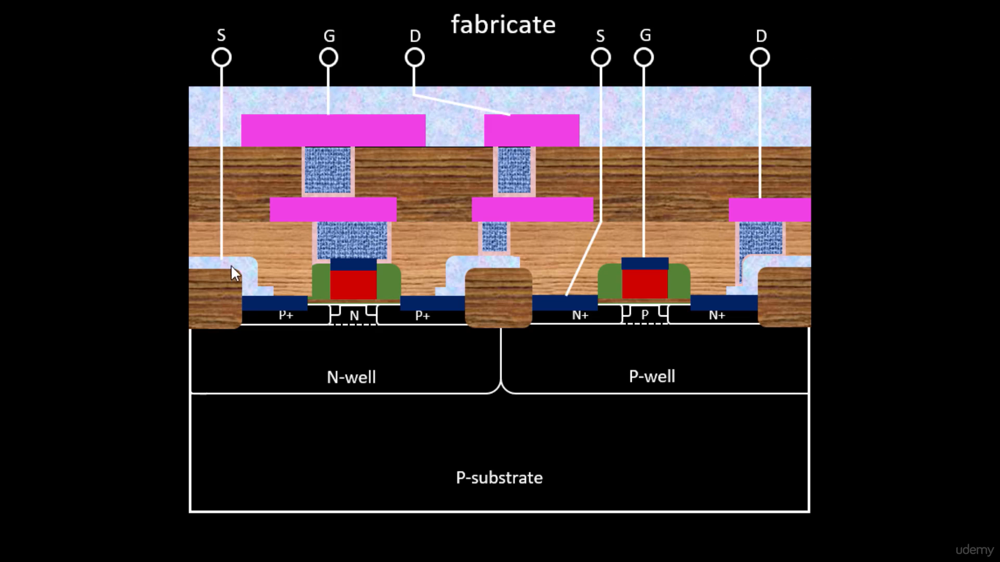
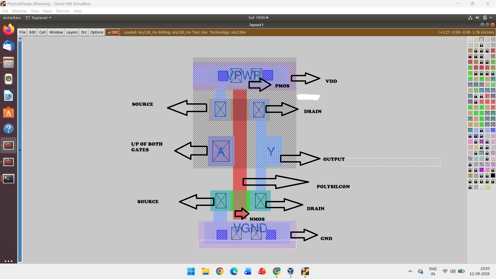

# CMOS Inverter — Fabrication, SPICE & Layout

<p align="center">
  
</p>

<h1 align="center">CMOS Inverter</h1>

<p align="center">
  <b>Fabrication • SPICE Simulation • Physical Layout • Verification</b>
</p>

<p align="center">
  A practical study of CMOS inverter fabrication, transistor formation,
  SPICE analysis, switching characteristics, physical layout and verification.
</p>


---

## 📚 Table of Contents

1. [CMOS Inverter](#1--cmos-inverter)
2. [CMOS Device Structure](#2--cmos-device-structure)
3. [Substrate Selection](#3--substrate-selection)
4. [N-Well Formation](#4--n-well-formation)
5. [Active Region & Isolation](#5--active-region--isolation)
6. [Gate Oxide & Polysilicon Gate](#6--gate-oxide--polysilicon-gate)
7. [Source & Drain Formation](#7--source--drain-formation)
8. [LDD & Spacer Formation](#8--ldd--spacer-formation)
9. [Contact Formation](#9--contact-formation)
10. [Silicidation](#10--silicidation)
11. [Metal Interconnection](#11--metal-interconnection)
12. [CMOS Inverter Operation](#12--cmos-inverter-operation)
13. [Switching Threshold Voltage](#13--switching-threshold-voltage)
14. [SPICE CMOS Inverter Simulation](#14--spice-cmos-inverter-simulation)
15. [Layout, Pre-Layout & Verification](#15--layout-pre-layout--verification)

---

# 1. 🔲 CMOS Inverter

A CMOS inverter is one of the basic building blocks of digital VLSI circuits.

It consists of:

- **PMOS** — Pull-up transistor
- **NMOS** — Pull-down transistor

The gates of both transistors are connected to the input, while their drains are connected together to form the output.

### Circuit

```text
                         VDD
                          │
                     ┌─────────┐
              VIN ───┤  PMOS   │
                     └────┬────┘
                          │
                          ├──────── VOUT
                          │
                     ┌────┴────┐
              VIN ───┤  NMOS   │
                     └────┬────┘
                          │
                         GND
```

### Truth Table

| VIN | PMOS | NMOS | VOUT |
|:---:|:----:|:----:|:----:|
| 0 | ON | OFF | HIGH |
| 1 | OFF | ON | LOW |

The CMOS inverter performs the NOT operation:

$$
V_{OUT} = \overline{V_{IN}}
$$

---

# 2. 🧱 CMOS Device Structure

CMOS uses complementary PMOS and NMOS transistors.

In a typical P-substrate CMOS process:

| Device | Body Region | Source / Drain |
|:------:|:-----------:|:--------------:|
| PMOS | N-Well | P+ |
| NMOS | P-Well / P-Substrate | N+ |

### Basic Structure

```text
                 PMOS                         NMOS

              P+     P+                   N+     N+
               │      │                    │      │
          ┌────┴──────┴────┐          ┌────┴──────┴────┐
          │     N-WELL     │          │   P-WELL /     │
          │                │          │  P-SUBSTRATE   │
          └────────────────┘          └────────────────┘

                    P-SUBSTRATE
```

### Main Device Regions

- N-Well
- P-Well / P-Substrate
- Active region
- Gate oxide
- Polysilicon gate
- Source
- Drain
- Contacts
- Metal interconnect

---

# 3. 🟫 Substrate Selection

The substrate is the starting silicon material used for CMOS fabrication.

For the process studied in this project, a **P-type substrate** is used.

### P-Type Substrate

```text
┌──────────────────────────────────────┐
│                                      │
│             P-SUBSTRATE              │
│                                      │
│            Silicon Wafer             │
│                                      │
└──────────────────────────────────────┘
```

### Purpose

The substrate provides the foundation for:

- Well formation
- NMOS formation
- Isolation
- Device fabrication

---

# 4. 🟦 N-Well Formation

The N-Well provides the body region required for the PMOS transistor.

### Basic Structure

```text
              N-WELL
        ┌─────────────────┐
        │                 │
        │    N-type       │
        │     Region      │
        │                 │
        └─────────────────┘
────────────────────────────────
           P-SUBSTRATE
────────────────────────────────
```

### General Process

```text
P-SUBSTRATE
     │
     ▼
PHOTORESIST
     │
     ▼
PHOTOLITHOGRAPHY
     │
     ▼
N-WELL IMPLANTATION
     │
     ▼
ANNEALING
     │
     ▼
N-WELL FORMATION
```

The N-Well allows the PMOS transistor to be fabricated inside the P-substrate.

---

# 5. 🟩 Active Region & Isolation

The **active region** is the portion of silicon where the source, channel and drain of the transistor are formed.

Isolation separates neighboring devices and prevents unwanted electrical connections.

### Active Region

```text
     ISOLATION          ACTIVE REGION          ISOLATION

┌─────────────┐    ┌────────────────────┐    ┌─────────────┐
│             │    │                    │    │             │
│             │    │ SOURCE → CHANNEL   │    │             │
│             │    │             → DRAIN│    │             │
└─────────────┘    └────────────────────┘    └─────────────┘
```

The basic transistor structure is:

```text
SOURCE ───── CHANNEL ───── DRAIN
```

---

# 6. ⚡ Gate Oxide & Polysilicon Gate

A thin gate oxide is formed over the active silicon region.

Polysilicon is then deposited and patterned to form the gate.

### MOS Gate Structure

```text
                 POLYSILICON
                      │
                ┌───────────┐
                │   GATE    │
                └───────────┘
────────────────────────────────
              GATE OXIDE
────────────────────────────────
      SOURCE      CHANNEL      DRAIN
        │            │            │
       N+/P+                     N+/P+
────────────────────────────────
               SILICON
```

The gate controls the formation of the channel between source and drain.

### Important Parameters

| Parameter | Meaning |
|:---------:|---------|
| W | Transistor width |
| L | Channel length |
| tox | Gate oxide thickness |
| VTH | Threshold voltage |

---

# 7. 🔵 Source & Drain Formation

Source and drain regions are created using selective ion implantation.

## NMOS

NMOS uses **N+ source and drain** regions.

```text
       N+ SOURCE                    N+ DRAIN
           │                            │
           ▼                            ▼

    ┌──────────┐                ┌──────────┐
    │          │                │          │
────┴──────────┴────────────────┴──────────┴────
                 NMOS CHANNEL
─────────────────────────────────────────────────
                    P-REGION
```

## PMOS

PMOS uses **P+ source and drain** regions.

```text
       P+ SOURCE                    P+ DRAIN
           │                            │
           ▼                            ▼

    ┌──────────┐                ┌──────────┐
    │          │                │          │
────┴──────────┴────────────────┴──────────┴────
                 PMOS CHANNEL
─────────────────────────────────────────────────
                    N-WELL
```

### Purpose

Source and drain provide the terminals through which current flows through the MOS transistor.

---

# 8. 🟨 LDD & Spacer Formation

**LDD = Lightly Doped Drain**

LDD regions are lightly doped extensions near the channel.

They help reduce the electric field near the drain and improve device reliability.

### Simplified Process

```text
STEP 1 — Gate Formation

             POLY
              │
──────────────┼──────────────
              │
────────────────────────────


STEP 2 — Light Implantation

          N-       N-
──────────┐         ┌──────────
          │   POLY  │
──────────┴─────────┴──────────


STEP 3 — Spacer Formation

             ││
          ┌──────┐
──────────┤ POLY ├──────────
          └──────┘


STEP 4 — Heavy Implantation

         N+          N+
──────────┐          ┌──────────
          │          │
──────────┴──────────┴──────────
```

### Advantages of LDD

- Reduces the drain electric field.
- Helps reduce hot-carrier effects.
- Improves device reliability.
- Supports better transistor operation.

---

# 9. 🔗 Contact Formation

Contacts provide electrical connections between transistor regions and metal layers.

### Contact Structure

```text
                METAL
────────────────────────────
                 │
              CONTACT
                 │
────────────────────────────
          DIFFUSION / POLY
```

### Contacts Can Connect

- Source
- Drain
- Polysilicon
- Well
- Substrate

Proper contact placement is essential for electrical connectivity.

---

# 10. 🔶 Silicidation

Silicidation is used to reduce the resistance of selected silicon regions.

A metal is deposited and reacted with silicon during thermal processing to form a metal silicide.

### Process

```text
Metal Deposition
       │
       ▼
Thermal Annealing
       │
       ▼
Metal + Silicon Reaction
       │
       ▼
Silicide Formation
       │
       ▼
Remove Unreacted Metal
       │
       ▼
Low-Resistance Region
```

### Benefits

Silicidation can reduce resistance in:

- Source
- Drain
- Polysilicon gate

This improves transistor and circuit performance.

---

# 11. 🛣️ Metal Interconnection

Metal layers are used to connect different devices and circuit nodes.

### Interconnect Structure

```text
                METAL 2
────────────────────────────────
                   │
                  VIA
                   │
────────────────────────────────
                METAL 1
────────────────────────────────
                   │
                CONTACT
                   │
────────────────────────────────
             DIFFUSION / POLY
```

### Main Components

| Component | Function |
|-----------|----------|
| Contact | Connects device to metal |
| Metal 1 | Local interconnection |
| Via | Connects different metal layers |
| Metal 2 | Higher-level routing |
| Higher metals | Long-distance and power routing |

---

# 12. 🔄 CMOS Inverter Operation

The CMOS inverter works through complementary switching.

## Input LOW

When:

$$
V_{IN}=0
$$

PMOS is ON and NMOS is OFF.

```text
             VDD
              │
            ┌─────┐
            │ PMOS│
            └─────┘
              │
              ├────── VOUT ≈ VDD
              │
            ┌─────┐
            │ NMOS│
            └─────┘
              │
             GND
```

Therefore:

```text
VIN = 0  →  VOUT = 1
```

---

## Input HIGH

When:

$$
V_{IN}=V_{DD}
$$

PMOS is OFF and NMOS is ON.

```text
             VDD
              │
            ┌─────┐
            │ PMOS│
            └─────┘
              │
              ├────── VOUT ≈ 0
              │
            ┌─────┐
            │ NMOS│
            └─────┘
              │
             GND
```

Therefore:

```text
VIN = 1  →  VOUT = 0
```

### Overall Operation

| Input | PMOS | NMOS | Output |
|:-----:|:----:|:----:|:------:|
| LOW | ON | OFF | HIGH |
| HIGH | OFF | ON | LOW |

---

# 13. 📈 Switching Threshold Voltage

The switching threshold voltage is represented by:

$$
V_M
$$

At the switching point:

$$
V_{IN}=V_{OUT}=V_M
$$

The PMOS and NMOS currents have equal magnitude:

$$
I_{DP}=-I_{DN}
$$

### Voltage Transfer Characteristic

```text
VOUT
 │
 │───────────────
 │               \
 │                \
 │                 \
 │                  \
 │                   ─────────
 │
 └────────────────────────────── VIN
                    │
                   VM
```

### Importance of VM

The switching threshold is useful for understanding:

- Logic transition
- Noise margins
- Input/output voltage levels
- CMOS inverter behavior

---

# 14. 🧪 SPICE CMOS Inverter Simulation

SPICE is used to analyze the CMOS inverter before physical layout.

## MOSFET Syntax

```text
Mname Drain Gate Source Bulk Model W=... L=...
```

## PMOS

```spice
M1 out in vdd vdd PMOS W=0.375u L=0.25u
```

| Terminal | Connection |
|----------|------------|
| Drain | out |
| Gate | in |
| Source | vdd |
| Bulk | vdd |

## NMOS

```spice
M2 out in 0 0 NMOS W=0.375u L=0.25u
```

| Terminal | Connection |
|----------|------------|
| Drain | out |
| Gate | in |
| Source | GND |
| Bulk | GND |

## Load Capacitor

```spice
Cload out 0 10f
```

The output load is:

$$
C_{LOAD}=10fF
$$

## Supply Voltage

```spice
Vdd vdd 0 2.5
```

Therefore:

$$
V_{DD}=2.5V
$$

## Input Voltage

```spice
Vin in 0 2.5
```

## Operating Point

```spice
.op
```

The `.op` command calculates the DC operating point of the circuit.

## DC Sweep

```spice
.dc Vin 0 2.5 0.05
```

The input voltage is swept from:

| Parameter | Value |
|-----------|-------|
| Start | 0 V |
| Stop | 2.5 V |
| Step | 0.05 V |

## Model Inclusion

```spice
.include tsmc_025um_model.mod
```

The exact model file and model names depend on the technology and PDK being used.

## Complete SPICE Example

```spice
* CMOS Inverter DC Analysis

M1 out in vdd vdd PMOS W=0.375u L=0.25u
M2 out in 0   0   NMOS W=0.375u L=0.25u

Cload out 0 10f

Vdd vdd 0 2.5
Vin in  0 2.5

.op

.dc Vin 0 2.5 0.05

.include tsmc_025um_model.mod

.end
```

---

# 15. 🖥️ Layout, Pre-Layout & Verification

## Pre-Layout Analysis

Before creating the physical layout, the CMOS inverter is analyzed using the schematic and SPICE model.

### Parameters Studied

- DC transfer characteristic
- Switching threshold
- Logic HIGH
- Logic LOW
- Current
- Power
- Load capacitance
- Delay-related behavior

### Pre-Layout Flow

```text
Schematic
    │
    ▼
SPICE Simulation
    │
    ▼
DC Analysis
    │
    ▼
Switching Threshold
    │
    ▼
Pre-Layout Analysis
    │
    ▼
Physical Layout
```

---

## Magic Layout

Magic is a VLSI layout editor and verification tool.

### Example Command

```bash
magic -d OGL
```

Magic can be used to:

- Create physical layouts
- Edit layout layers
- Connect devices
- Inspect geometry
- Run DRC
- Extract circuit information
- Support LVS verification

---

# 🖼️ CMOS Fabrication

The following image shows the CMOS fabrication/device structure studied in this project.

<p align="center">
  
</p>

<p align="center">
  <b>CMOS Fabrication Structure</b>
</p>

---

# 🖥️ CMOS Inverter Layout

The following image shows the physical CMOS inverter layout created using Magic.

<p align="center">
  
</p>

<p align="center">
  <b>CMOS Inverter Layout using Magic</b>
</p>

---

# 🔍 Layout Elements

The CMOS inverter layout contains the following important physical layers and connections:

| Layout Element | Purpose |
|----------------|---------|
| N-Well | PMOS body region |
| P-Substrate / P-Well | NMOS body region |
| Active | Source and drain formation |
| Polysilicon | Gate |
| Contact | Device-to-metal connection |
| Metal | Electrical interconnection |
| VDD | Power supply |
| GND | Ground |
| VIN | Input |
| VOUT | Output |

### Simplified Physical Layout

```text
                         VDD
                          │
                ┌─────────────────┐
                │      PMOS       │
                │     N-WELL      │
                └────────┬────────┘
                         │
                         ├────────── VOUT
                         │
                ┌────────┴────────┐
                │      NMOS       │
                │ P-SUB / P-WELL  │
                └─────────────────┘
                         │
                        GND

                VIN → POLYSILICON GATE
```

---

# ✅ DRC & LVS Verification

After creating the physical layout, the layout must be verified.

## DRC — Design Rule Check

DRC verifies whether the physical layout follows the manufacturing design rules.

Typical checks include:

- Minimum width
- Minimum spacing
- Contact dimensions
- Layer overlap
- Enclosure requirements

```text
LAYOUT
   │
   ▼
 DRC
   │
   ▼
PASS / ERRORS
```

---

## LVS — Layout Versus Schematic

LVS checks whether the extracted layout corresponds to the intended schematic.

```text
SCHEMATIC                    LAYOUT
    │                           │
    │                           │
    └──────────┬────────────────┘
               │
               ▼
              LVS
               │
               ▼
        MATCH / MISMATCH
```

A successful LVS indicates that the physical layout represents the intended circuit connectivity.

---

# 🖼️ Project Screenshots

## Fabrication CMOS

<p align="center">
  
</p>

---

## CMOS Inverter Layout

<p align="center">
  
</p>

---

# 🔁 Complete CMOS Design Flow

```text
                    CMOS FABRICATION
                           │
                           ▼
                       SUBSTRATE
                           │
                           ▼
                     WELL FORMATION
                           │
                           ▼
                     ACTIVE REGION
                           │
                           ▼
                       GATE OXIDE
                           │
                           ▼
                    POLYSILICON GATE
                           │
                           ▼
                  SOURCE / DRAIN IMPLANT
                           │
                           ▼
                      LDD / SPACER
                           │
                           ▼
                      SILICIDATION
                           │
                           ▼
                   CONTACT FORMATION
                           │
                           ▼
                  METAL INTERCONNECTION
                           │
                           ▼
                    SPICE SIMULATION
                           │
                           ▼
                   PRE-LAYOUT ANALYSIS
                           │
                           ▼
                      MAGIC LAYOUT
                           │
                           ▼
                           DRC
                           │
                           ▼
                           LVS
                           │
                           ▼
                  VERIFIED CMOS LAYOUT
```

---

# 📌 Key Takeaways

| Topic | Key Point |
|-------|-----------|
| CMOS | Uses complementary PMOS and NMOS |
| PMOS | Fabricated inside N-Well |
| NMOS | Fabricated in P-type region |
| Gate | Controls channel formation |
| Source / Drain | Carry transistor current |
| LDD | Reduces drain electric field |
| Silicide | Reduces resistance |
| Contact | Connects device to metal |
| Metal | Provides interconnection |
| SPICE | Used for circuit simulation |
| `.op` | Operating point analysis |
| `.dc` | DC voltage sweep |
| VM | Switching threshold voltage |
| Magic | Physical layout editor |
| DRC | Checks layout design rules |
| LVS | Checks layout against schematic |

---

# 🛠️ Tools Used

| Tool | Purpose |
|------|---------|
| **SPICE** | Circuit simulation |
| **Magic** | Physical layout |
| **CMOS PDK** | Technology information |
| **Linux** | VLSI design environment |
| **Git** | Version control |
| **GitHub** | Project repository |

---


# 🚀 Conclusion

This project covers the CMOS inverter design flow from semiconductor fabrication to physical layout and verification.

### Complete Learning Path

```text
FABRICATION
     ↓
DEVICE FORMATION
     ↓
CMOS INVERTER
     ↓
SPICE SIMULATION
     ↓
PRE-LAYOUT ANALYSIS
     ↓
PHYSICAL LAYOUT
     ↓
DRC
     ↓
LVS
     ↓
FINAL VERIFIED DESIGN
```

The concepts covered in this project provide a foundation for further studies in:

- VLSI Design
- CMOS Digital Design
- Physical Design
- ASIC Design
- SPICE Simulation
- Standard Cell Design
- Layout Design

---

<p align="center">
  <b>CMOS Inverter | VLSI Learning Project</b>
</p>

<p align="center">
  Fabrication → Simulation → Layout → Verification
</p>
