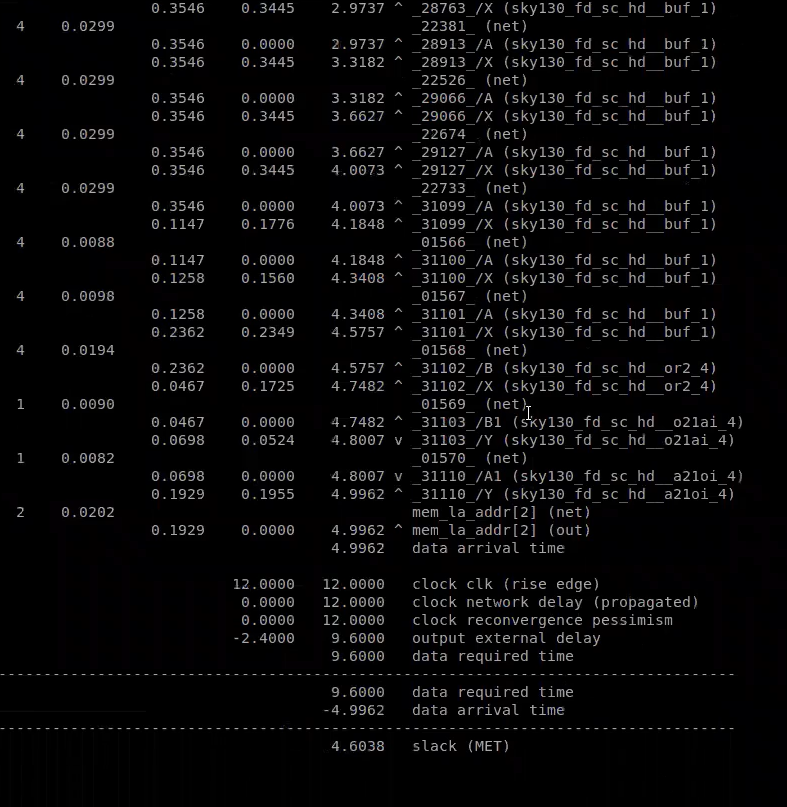

#  Timing Analysis & Clock Tree Synthesis


<p align="center">
  <b>Timing Modelling • Timing Analysis • Clock Tree Synthesis • Signal Integrity</b>
</p>

<p align="center">
  A practical study of timing modelling, delay tables, setup and hold analysis,
  clock jitter, clock skew, CTS, crosstalk and real-clock timing analysis using the SKY130 flow.
</p>

---

## 📚 Table of Contents

1. [⏱️ Timing Modelling](#1--timing-modelling)
2. [📊 Delay Tables](#2--delay-tables)
3. [⚡ Input Slew & Output Load](#3--input-slew--output-load)
4. [🕐 Setup Timing Analysis](#4--setup-timing-analysis)
5. [🔒 Hold Timing Analysis](#5--hold-timing-analysis)
6. [⚠️ Clock Jitter & Uncertainty](#6--clock-jitter--uncertainty)
7. [🌳 Clock Tree Synthesis](#7--clock-tree-synthesis)
8. [📐 Clock Skew & Clock Latency](#8--clock-skew--clock-latency)
9. [🔊 Crosstalk & Signal Integrity](#9--crosstalk--signal-integrity)
10. [🛡️ Clock Shielding](#10--clock-shielding)
11. [🔄 Ideal Clock vs Real Clock](#11--ideal-clock-vs-real-clock)
12. [🔬 Static Timing Analysis using OpenSTA](#12--static-timing-analysis-using-opensta)
13. [📈 WNS & TNS](#13--wns--tns)
14. [💻 Important OpenLane & OpenROAD Commands](#14--important-openlane--openroad-commands)
15. [🎯 Day 4 Key Takeaways](#15--day-4-key-takeaways)

---

# 1. ⏱️ Timing Modelling

Timing modelling is an important part of the physical design flow.

A **standard cell does not have a fixed delay**. The delay of a cell changes depending on the input transition and the load connected to its output.

### 🔹 Basic Concept

```text
          Input Transition
                 │
                 ▼
          ┌─────────────┐
          │ Standard    │
          │    Cell     │
          └──────┬──────┘
                 │
                 ▼
             Cell Delay
                 ▲
                 │
            Output Load
```

The basic relationship is:

**Cell Delay = f(Input Slew, Output Load)**

### 🔹 Important Parameters

| Parameter | Meaning |
|:---|:---|
| **Input Slew** | How quickly the input signal changes |
| **Output Load** | Capacitance driven by the cell |
| **Cell Delay** | Time taken by the cell to produce the output |
| **Transition** | Time required for a signal to change between logic levels |

### 🔹 Why Timing Modelling is Required?

During timing analysis, the tool needs to determine the delay of every standard cell under different operating conditions.

Instead of performing transistor-level simulation for every timing path, the timing characteristics of cells are **characterized and stored in timing libraries**.

These timing models are then used by tools such as:

- Synthesis tools
- Static Timing Analysis tools
- Placement optimization tools
- Routing optimization tools

### 💡 Key Idea

> **Cell delay mainly depends on input transition and output load.**

A slower input transition or a larger output load generally increases the delay of the standard cell.

---
# 2. 📊 Delay Tables

Cell timing information is represented using **delay tables**.

A delay table provides the cell delay for different combinations of:

- Input transition
- Output capacitance

### 🔹 Simplified Delay Table

| Input Slew ↓ / Output Load → | Low | Medium | High |
|:---|---:|---:|---:|
| **Fast** | Low Delay | Low Delay | Medium Delay |
| **Medium** | Low Delay | Medium Delay | High Delay |
| **Slow** | Medium Delay | High Delay | High Delay |

### 🔹 How to Understand the Table

```text
Input Slew  ───────►
                    │
                    ▼
              ┌───────────┐
              │   Delay   │
              │   Table   │
              └───────────┘
                    ▲
                    │
Output Load ────────┘
```

The timing tool uses the input transition and output load to select the appropriate delay value from the table.

### 💡 Key Idea

> **Higher output load + slower input transition generally results in higher cell delay.**

---

# 3. ⚡ Input Slew & Output Load

Two important parameters that affect cell delay are **input slew** and **output load**.

## 🔹 Input Slew

Input slew represents how quickly a signal changes from one logic level to another.

```text
Voltage
  │
  │             ┌────────
  │            /
  │           /
  │          /
  │─────────┘
  │
  └──────────────────────► Time
```

A faster transition means the signal changes quickly.

A slower transition means the signal takes more time to reach the required voltage level.

### 🔹 Output Load

Output load represents the capacitance that the standard cell must drive.

```text
              Standard Cell
                   │
                   │
                   ▼
              ┌─────────┐
              │  Load   │
              │   C     │
              └─────────┘
```

When the output load increases, the cell needs more time to charge or discharge the load.

### 🔹 Relationship

```text
Input Slew ↓
Output Load ↓
     │
     ▼
Cell Delay ↓
```

```text
Input Slew ↑
Output Load ↑
     │
     ▼
Cell Delay ↑
```

### 📌 Summary

| Condition | Cell Delay |
|:---|:---:|
| Fast Slew + Low Load | Low |
| Fast Slew + High Load | Moderate |
| Slow Slew + Low Load | Moderate |
| Slow Slew + High Load | High |

> **Cell delay is strongly dependent on both input transition and output load.**

---

# 4. 🕐 Setup Timing Analysis

**Setup timing** checks whether data reaches the capture flip-flop early enough before the active clock edge.

A typical timing path is:

```text
Launch FF
    │
    ▼
Combinational Logic
    │
    ▼
Capture FF
```

The data launched from the first flip-flop must propagate through the combinational logic and reach the capture flip-flop within the available timing window.

### 🔹 Setup Requirement

For an ideal clock:

```text
Data Delay < Clock Period - Setup Time
```

When clock uncertainty is included:

```text
Available Time
=
Clock Period
- Setup Time
- Setup Uncertainty
```

### 🔹 Setup Slack

```text
Setup Slack
=
Required Time - Arrival Time
```

### 🔹 Timing Condition

```text
Setup Slack > 0
        │
        ▼
   Timing Passed
```

```text
Setup Slack < 0
        │
        ▼
   Setup Violation
```

### 🔹 Example

Consider:

```text
Clock Period   = 1 ns
Setup Time     = 0.10 ns
Uncertainty    = 0.05 ns
```

Available timing:

```text
1 - 0.10 - 0.05
= 0.85 ns
```

Therefore, the data path should complete within the available timing window.

### 💡 Key Idea

> **Setup analysis ensures that data does not arrive too late at the capture flip-flop.**

---

# 5. 🔒 Hold Timing Analysis

**Hold timing** checks whether data remains stable for the required amount of time after the active clock edge.

```text
                 Hold Window
                      │
                      ▼
Clock ────────────────┼────────────
                      │
Data  ────────────────┴────────────
                      │
                Must remain stable
```

The data must not reach the capture flip-flop too early.

### 🔹 Hold Requirement

For an ideal clock:

```text
Data Delay > Hold Time
```

For a real clock:

```text
O + d₁ > H + d₂
```

Where:

- **O** = Data path delay
- **d₁** = Launch clock delay
- **d₂** = Capture clock delay
- **H** = Hold time

### 🔹 Hold Slack

```text
Hold Slack
=
Arrival Time - Required Time
```

### 🔹 Timing Condition

```text
Hold Slack > 0
        │
        ▼
    Timing Passed
```

```text
Hold Slack < 0
        │
        ▼
    Hold Violation
```

### 🔹 Setup vs Hold

| Setup | Hold |
|:---|:---|
| Data arrives too late | Data arrives too early |
| Maximum delay check | Minimum delay check |
| Checked before capture edge | Checked after capture edge |
| Setup time is important | Hold time is important |

### 💡 Key Idea

> **Hold analysis ensures that data does not change too early after the capture clock edge.**

---

# 6. ⚠️ Clock Jitter & Uncertainty

In a real circuit, the clock edge does not always occur at exactly the expected time.

This variation is called **clock jitter**.

```text
Expected Clock Edge
         │
         ▼
─────────┼─────────
      ← Jitter →
```

The actual clock edge may occur slightly earlier or later than expected.

## 🔹 Clock Uncertainty

Clock uncertainty represents the additional timing margin used to account for clock variations.

It can include effects such as:

- Clock jitter
- Clock variation
- Other clock-related uncertainties

### 🔹 Effect on Setup Timing

```text
Available Time
=
Clock Period
- Setup Time
- Clock Uncertainty
```

Therefore:

```text
Clock Uncertainty ↑
        │
        ▼
Timing Margin ↓
```

### 🔹 Why is it Important?

If the clock arrival is uncertain, the data path cannot safely use the entire clock period.

Therefore, timing analysis includes uncertainty to provide a realistic timing margin.

### 💡 Key Idea

> **Clock jitter and uncertainty reduce the available timing margin.**

---

# 7. 🌳 Clock Tree Synthesis

**Clock Tree Synthesis (CTS)** is the process of creating a clock distribution network between the clock source and sequential elements.

A clock source may need to drive a large number of flip-flops.

Directly connecting the clock to all flip-flops can result in:

- High fanout
- Large capacitance
- Large delay
- Unequal clock arrival times

CTS solves this by creating a balanced clock network using buffers.

### 🔹 Basic Clock Tree

```text
                    Clock Source
                         │
                       Buffer
                         │
                  ┌──────┴──────┐
                  │             │
               Buffer        Buffer
                │               │
           ┌────┴────┐     ┌────┴────┐
           │         │     │         │
          FF1       FF2    FF3       FF4
```

### 🔹 Objectives of CTS

CTS attempts to:

- Reduce clock skew
- Control clock latency
- Balance clock paths
- Improve clock transition
- Drive large capacitive loads
- Maintain clock signal integrity

### 🔹 TritonCTS

In the OpenLane/OpenROAD flow, **TritonCTS** is used for Clock Tree Synthesis.

The CTS stage can be executed using:

```tcl
run_cts
```

### 💡 Key Idea

> **CTS distributes the clock efficiently while trying to minimize skew and control clock latency.**

---

# 8. 📐 Clock Skew & Clock Latency

## 🔹 Clock Skew

Clock skew is the difference in clock arrival time between two sequential elements.

```text
                 Clock Source
                      │
                ┌─────┴─────┐
                │           │
               FF1         FF2
                │           │
               t₁           t₂
```

Therefore:

```text
Clock Skew = t₂ - t₁
```

Ideally:

```text
Clock Skew ≈ 0
```

### 🔹 Why Skew Matters?

Large clock skew can affect:

- Setup timing
- Hold timing
- Timing margin
- Sequential circuit operation

---

## 🔹 Clock Latency

Clock latency is the time taken by the clock signal to travel from its source to a sequential element.

It can include:

```text
Clock Latency
=
Buffer Delay
+
Wire Delay
+
RC Effects
```

### 🔹 Clock Network

```text
Clock Source
     │
     ▼
  Buffer
     │
     ▼
   Wire
     │
     ▼
  Buffer
     │
     ▼
 Flip-Flop
```

### 💡 Key Idea

> **CTS tries to distribute the clock so that clock arrival times are balanced and predictable.**

---

# 9. 🔊 Crosstalk & Signal Integrity

When two nearby metal wires interact through coupling capacitance, the resulting effect is called **crosstalk**.

```text
Aggressor Wire
══════════════════════════
          ↕
   Coupling Capacitance
          ↕
Victim Wire
══════════════════════════
```

A switching signal on the aggressor can disturb the victim signal.

### 🔹 Effects of Crosstalk

Crosstalk can cause:

- Noise
- Glitches
- Delay variation
- Timing variation
- Clock disturbance
- Signal integrity problems

### 🔹 Crosstalk and Delay

```text
Normal Delay
     +
Crosstalk Effect
     │
     ▼
Actual Delay
```

This becomes particularly important for critical signals such as clocks.

### 🔹 Signal Integrity

Signal integrity deals with maintaining the quality and correctness of signals during physical propagation.

Important factors include:

- Coupling
- Crosstalk
- Noise
- Delay variation
- Transition degradation

### 💡 Key Idea

> **Crosstalk can change signal behaviour and therefore affect timing.**

---

# 10. 🛡️ Clock Shielding

The clock is one of the most critical signals in a digital circuit.

Nearby signal wires can couple with the clock and introduce unwanted noise or delay variation.

**Clock shielding** is one technique used to reduce this coupling.

### 🔹 Simplified Structure

```text
       Shield          Clock          Shield
══════════════       ═══════       ══════════════
      GND               CLK              GND
```

The shield is connected to a stable supply such as:

```text
VDD
or
GND
```

### 🔹 Benefits

Clock shielding helps to:

- Reduce coupling capacitance
- Reduce crosstalk
- Reduce noise
- Protect clock integrity
- Improve timing stability

### 💡 Key Idea

> **Critical nets such as clocks require special routing techniques to maintain signal integrity.**

---

# 11. 🔄 Ideal Clock vs Real Clock

Clock timing analysis can be performed using an **ideal clock** before CTS and a **real/propagated clock** after CTS.

## 🔹 Ideal Clock

Before CTS, the clock can be treated as ideal.

```text
                 Clock
                   │
             ┌─────┴─────┐
             │           │
            FF1         FF2
```

The physical delay through the clock tree is not included.

This is useful for preliminary timing analysis.

---

## 🔹 Real Clock

After CTS, the clock propagates through the actual clock network.

```text
                 Clock
                   │
                 Buffer
                   │
                  Wire
                   │
              ┌────┴────┐
           Buffer      Buffer
             │            │
            FF1          FF2
```

Now timing analysis considers:

- Clock buffers
- Clock wire delay
- Clock latency
- Clock skew
- Parasitic effects

### 🔹 Comparison

| Feature | Ideal Clock | Real Clock |
|:---|:---:|:---:|
| Clock Buffers | ❌ | ✅ |
| Wire Delay | ❌ | ✅ |
| Clock Latency | Idealized | Included |
| Clock Skew | Idealized | Real |
| RC Effects | ❌ | ✅ |
| Timing Accuracy | Preliminary | More realistic |

### 🔄 Transition

```text
Ideal Clock
     │
     ▼
Pre-CTS Timing Analysis
     │
     ▼
Clock Tree Synthesis
     │
     ▼
Real / Propagated Clock
     │
     ▼
Post-CTS Timing Analysis
```

### 💡 Key Idea

> **Real-clock analysis gives a more realistic picture of timing because the actual clock network is included.**

---

# 12. 🔬 Static Timing Analysis using OpenSTA

**Static Timing Analysis (STA)** is used to determine whether the design satisfies its timing requirements.

OpenSTA analyzes timing paths without requiring functional simulation vectors.

### 🔹 Typical Timing Path

```text
Launch Flip-Flop
       │
       ▼
Combinational Logic
       │
       ▼
Capture Flip-Flop
```

OpenSTA can calculate:

- Arrival Time
- Required Time
- Slack
- Setup Timing
- Hold Timing
- Clock Skew
- Critical Paths

### 🔹 Slack

The basic timing relationship is:

```text
Slack = Required Time - Arrival Time
```

### 🔹 Timing Result

```text
Positive Slack
      │
      ▼
Timing Passed
```

```text
Zero Slack
      │
      ▼
Timing Met
```

```text
Negative Slack
      │
      ▼
Timing Violation
```

### 🔹 Propagated Clock

After CTS, the actual clock network can be propagated during timing analysis.

This allows the timing tool to consider:

- Clock buffer delays
- Clock wire delays
- Clock latency
- Clock skew

### 💡 Key Idea

> **OpenSTA is used to verify whether timing paths satisfy setup and hold requirements.**

---

# 13. 📈 WNS & TNS

Two important timing-quality parameters are:

- **WNS — Worst Negative Slack**
- **TNS — Total Negative Slack**

---

## 🔹 WNS — Worst Negative Slack

WNS represents the worst slack among all analyzed timing paths.

```text
WNS = Minimum Slack
```

### Example

```text
Path 1 → +0.20 ns
Path 2 → -0.05 ns
Path 3 → -0.15 ns
```

Therefore:

```text
WNS = -0.15 ns
```

A negative WNS indicates that at least one timing path has a violation.

---

## 🔹 TNS — Total Negative Slack

TNS represents the sum of all negative slack values.

```text
TNS = Sum of Negative Slack Values
```

### Example

```text
Path 1 → -0.05 ns
Path 2 → -0.10 ns
Path 3 → -0.15 ns
```

Therefore:

```text
TNS = -0.30 ns
```

### 🔹 Ideal Timing Condition

```text
WNS ≥ 0
```

```text
TNS = 0
```

This indicates that there are no negative timing paths.

### 💡 Key Idea

> **WNS identifies the worst timing problem, while TNS indicates the overall amount of negative slack in the design.**

---

# 14. 💻 Important OpenLane & OpenROAD Commands

The following commands are useful during the Day 4 physical-design flow.

## 🔹 Run Synthesis

```tcl
run_synthesis
```

---

## 🔹 Run Floorplan

```tcl
run_floorplan
```

---

## 🔹 Run Placement

```tcl
run_placement
```

---

## 🔹 Run Clock Tree Synthesis

```tcl
run_cts
```

---

## 🔹 Check Synthesis Strategy

```tcl
echo $::env(SYNTH_STRATEGY)
```

---

## 🔹 Enable Synthesis Buffering

```tcl
set ::env(SYNTH_BUFFERING) 1
```

---

## 🔹 Enable Synthesis Sizing

```tcl
set ::env(SYNTH_SIZING) 1
```

---

## 🔹 Start OpenROAD

```bash
openroad
```

---

## 🔹 Generate Timing Report

```tcl
report_checks -path_delay min_max \
-format full_clock_expanded \
-digits 4
```

---

## 🔹 Setup Clock Skew

```tcl
report_clock_skew -setup
```

---

## 🔹 Hold Clock Skew

```tcl
report_clock_skew -hold
```

### 🔹 Important Timing Values

When reading the timing report, pay attention to:

| Parameter | What it tells you |
|:---|:---|
| **Arrival Time** | When data reaches the endpoint |
| **Required Time** | Latest/earliest allowed arrival |
| **Slack** | Timing margin |
| **Data Delay** | Delay through the data path |
| **Clock Delay** | Delay through the clock path |
| **Clock Skew** | Difference in clock arrival times |
| **WNS** | Worst timing slack |
| **TNS** | Total negative slack |

---

# 15. 🎯  Key Takeaways


### 🧠 Major Concepts Learned

- Standard-cell delay depends on **input slew and output load**.
- Delay tables store characterized timing information.
- Setup analysis checks whether data arrives **too late**.
- Hold analysis checks whether data arrives **too early**.
- Clock jitter causes variation in clock arrival.
- Clock uncertainty reduces available timing margin.
- Clock Tree Synthesis creates a clock distribution network.
- TritonCTS is used for Clock Tree Synthesis.
- Clock skew represents the difference in clock arrival time.
- Clock latency represents the delay from the clock source to a sequential element.
- Crosstalk occurs because of coupling between nearby interconnects.
- Crosstalk can affect signal delay and signal integrity.
- Clock shielding helps reduce coupling around critical clock nets.
- Ideal clocks are used for preliminary timing analysis.
- Real clocks include actual clock-tree delays.
- OpenSTA performs Static Timing Analysis.
- WNS represents the worst timing slack.
- TNS represents the total negative slack.
- Both setup and hold timing must be satisfied.

---

## 🔄 Complete  Flow

```text
             Timing Modelling
                    │
                    ▼
              Delay Tables
                    │
                    ▼
           Input Slew + Load
                    │
                    ▼
             Ideal Clock STA
                    │
                    ▼
                Placement
                    │
                    ▼
          Clock Tree Synthesis
               (TritonCTS)
                    │
                    ▼
            Clock Skew Analysis
                    │
                    ▼
           Crosstalk / Signal Integrity
                    │
                    ▼
              Real Clock STA
                    │
              ┌─────┴─────┐
              ▼           ▼
            Setup        Hold
              │           │
              └─────┬─────┘
                    ▼
             Timing Reports
                    │
                    ▼
                 WNS / TNS
                    │
                    ▼
              Timing Closure
```

---

## 📊 Setup vs Hold — Quick Reference

| Feature | Setup | Hold |
|:---|:---:|:---:|
| Main Check | Data arrives late | Data arrives early |
| Timing Type | Maximum delay | Minimum delay |
| Related Parameter | Setup Time | Hold Time |
| Uncertainty | Setup Uncertainty | Hold Uncertainty |
| Violation | Negative Setup Slack | Negative Hold Slack |
| Goal | Slack ≥ 0 | Slack ≥ 0 |

---

## 📊 Ideal Clock vs Real Clock

| Feature | Ideal Clock | Real Clock |
|:---|:---:|:---:|
| CTS | Before CTS | After CTS |
| Clock Network | Idealized | Physical |
| Buffers | Ignored | Included |
| Wire Delay | Ignored | Included |
| Skew | Idealized | Measured |
| Latency | Idealized | Included |
| RC Effects | Ignored | Included |
| Timing Accuracy | Preliminary | More realistic |

---

## 🛠️ Tools Used

| Tool | Purpose |
|:---|:---|
| **OpenLane** | Automated RTL-to-GDSII flow |
| **Yosys** | RTL synthesis |
| **OpenROAD** | Physical design |
| **OpenSTA** | Static Timing Analysis |
| **TritonCTS** | Clock Tree Synthesis |
| **SKY130 PDK** | Technology/process information |
| **Magic** | Layout and physical verification |
| **Linux** | VLSI design environment |

---

## 📌 Final Summary

The main learning progression of Day 4 was:

```text
Timing Modelling
       ↓
Delay Tables
       ↓
Input Slew & Output Load
       ↓
Setup & Hold Analysis
       ↓
Clock Jitter & Uncertainty
       ↓
Clock Tree Synthesis
       ↓
Clock Skew & Latency
       ↓
Crosstalk
       ↓
Clock Shielding
       ↓
Ideal Clock Analysis
       ↓
Real Clock Analysis
       ↓
OpenSTA
       ↓
WNS & TNS
       ↓
Timing Closure
```

Day 4 demonstrated how timing analysis evolves from an **idealized clock model to a realistic physical clock network**.

The actual physical implementation introduces:

```text
Cell Delay
    +
Wire Delay
    +
Clock Delay
    +
Clock Skew
    +
RC Effects
    +
Crosstalk
    ↓
Realistic Timing
```

---

# 🏁 Conclusion

Mainly focused on one of the most important aspects of ASIC physical design — **timing**.

The learning started with standard-cell timing models and delay tables and progressed towards setup and hold analysis, clock uncertainty, Clock Tree Synthesis, clock skew, crosstalk and real-clock timing analysis.

The complete concept can be summarized as:

```text
                    TIMING
                       │
             ┌─────────┴─────────┐
             ▼                   ▼
          DATA PATH          CLOCK PATH
             │                   │
             ▼                   ▼
       Cell + Wire          CTS + Buffers
          Delay              + Wire Delay
             │                   │
             └─────────┬─────────┘
                       ▼
                    OpenSTA
                       │
                ┌──────┴──────┐
                ▼             ▼
              Setup          Hold
                │             │
                └──────┬──────┘
                       ▼
                 Timing Closure
```
### 📸 OpenSTA Timing Report

The following timing report was generated using OpenSTA after timing analysis.

<p align="center">
  
</p>

### 🔍 Timing Result

| Parameter | Value |
|:---|---:|
| Clock Period | **12.0000 ns** |
| Data Arrival Time | **4.9962 ns** |
| Data Required Time | **9.6000 ns** |
| Slack | **4.6038 ns** |
| Timing Status | ✅ **MET** |

### 🧠 Observation

The reported slack is:

```text
4.6038 ns
```

Since the slack is positive, the analyzed timing path satisfies the timing requirement.

```text
Slack > 0
   ↓
Timing Requirement Satisfied
   ↓
✅ MET
```

This confirms that the analyzed path has sufficient timing margin.
