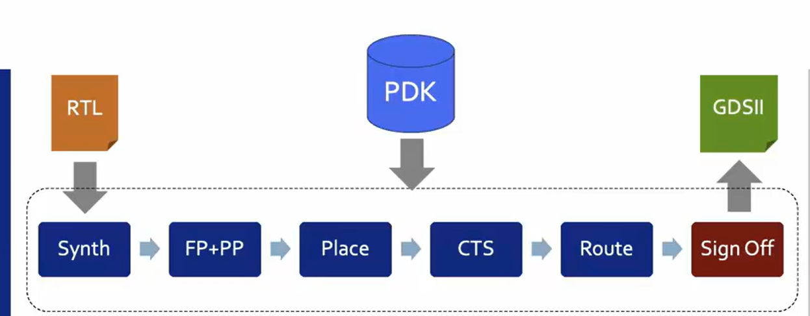
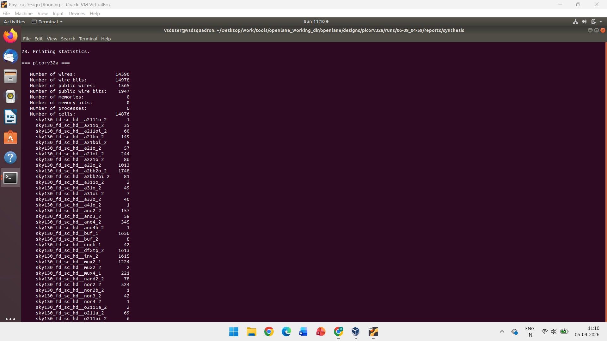
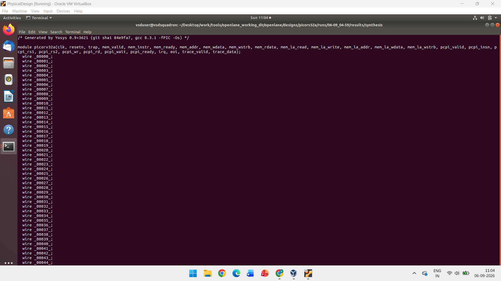
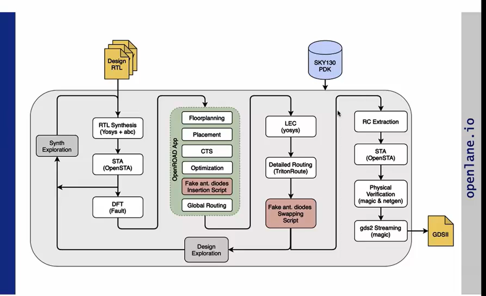
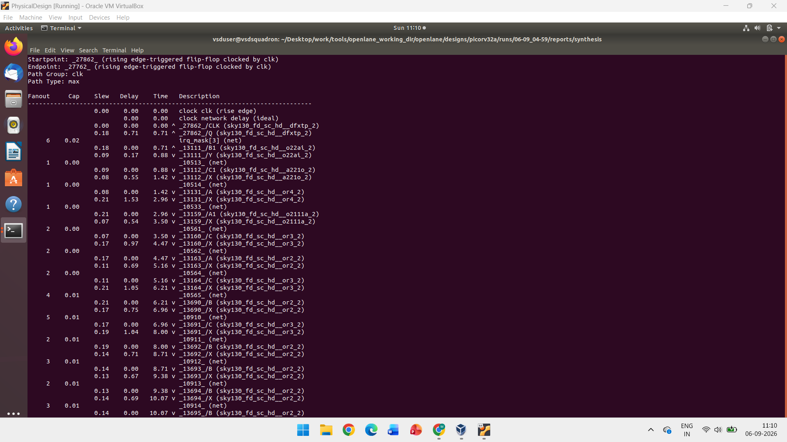
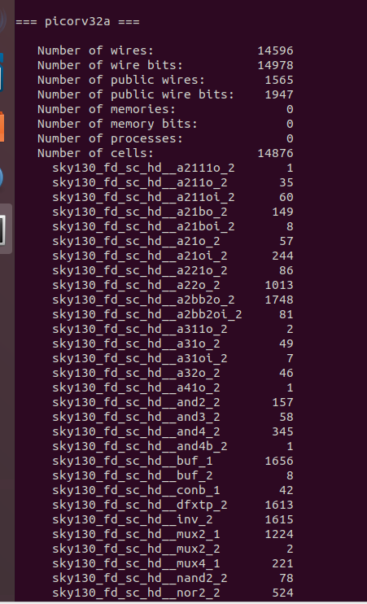

# OpenLane Physical Design – PicoRV32A

A simple learning project showing the **RTL to GDSII flow** using **PicoRV32A, OpenLane and Sky130 PDK**.

The project covers synthesis, floorplanning, placement, CTS, routing, STA and signoff.

---

## 1. Project Overview

ASIC physical design is the process of converting a digital design into a physical chip layout.

In this project, the PicoRV32A RISC-V processor is used to understand the complete physical design flow.

### Flow

```text
RTL
 ↓
Synthesis
 ↓
Floorplanning
 ↓
Placement
 ↓
CTS
 ↓
Routing
 ↓
Signoff
 ↓
GDSII
```



---

## 2. PicoRV32A

PicoRV32A is a small **RISC-V processor** written in RTL.

RTL describes the working of the digital circuit.

The design contains:

- Logic gates
- Flip-flops
- Multiplexers
- Registers
- Control logic

The RTL is used as the input for synthesis.

---

## 3. PDK

**PDK stands for Process Design Kit.**

A PDK provides the technology information needed to design a chip.

It contains:

- Standard cell information
- Technology layers
- Design rules
- Timing information
- Physical information

For this project, the **Sky130 PDK** is used.

---

## 4. OpenLane

**OpenLane is an open-source RTL-to-GDSII flow.**

It connects different tools and performs the main physical design steps.

### Simple OpenLane Flow

```text
RTL + PDK
   ↓
Synthesis
   ↓
Floorplanning
   ↓
Placement
   ↓
CTS
   ↓
Routing
   ↓
Signoff
   ↓
GDSII
```

OpenLane makes the ASIC physical design flow easier to perform using open-source tools.

---

## 5. Synthesis

**Synthesis converts RTL into a gate-level netlist.**

The RTL is read by the synthesis tool and converted into standard cells from the library.

```text
RTL
 ↓
Synthesis
 ↓
Gate-Level Netlist
```

The synthesized design can contain:

- AND gates
- OR gates
- NAND gates
- NOR gates
- Buffers
- Inverters
- Multiplexers
- Flip-flops

### Synthesis Result



---

## 6. Netlist

A **netlist shows the cells used in the circuit and their connections**.

After synthesis, the RTL is converted into a gate-level netlist.

```text
RTL
 ↓
Standard Cells
 ↓
Connections
 ↓
Gate-Level Netlist
```

The PicoRV32A design contains many standard cells.

### Generated Netlist



---

## 7. Floorplanning

**Floorplanning decides the basic physical arrangement of the chip.**

It decides:

- Chip size
- Core size
- I/O pin locations
- Area available for cells

A good floorplan helps in placement and routing.

---

## 8. Power Planning

**Power planning creates the power network of the chip.**

It includes:

- Power rings
- Power straps
- Power rails
- VDD
- VSS

The main purpose is to distribute power properly to all the cells.

---

## 9. Placement

**Placement decides where the standard cells are physically placed.**

Placement mainly has two steps.

### Global Placement

Finds approximate locations for the cells.

### Detailed Placement

Moves the cells to legal and proper positions.

Good placement helps to:

- Reduce wire length
- Reduce congestion
- Improve timing
- Make routing easier

---

## 10. Clock Tree Synthesis

**CTS means Clock Tree Synthesis.**

CTS creates the clock network for sequential cells such as flip-flops.

Buffers are added to distribute the clock properly.

### Main Goal

The main goal is to make the clock reach all flip-flops at the correct time.

CTS also tries to reduce **clock skew**.

```text
        Clock
          |
       Buffer
      /  |  \
    FF1 FF2 FF3
```

---

## 11. Routing

**Routing connects all the placed cells using metal layers.**

There are two main steps.

### Global Routing

Finds the approximate path for the connections.

### Detailed Routing

Creates the actual metal connections.

Routing must follow the technology design rules.

### RTL to GDSII Flow



---

## 12. STA

**STA means Static Timing Analysis.**

STA checks whether the circuit meets the required timing.

It checks:

- Cell delay
- Net delay
- Clock delay
- Setup time
- Hold time
- Slew

### Slack

Slack tells us whether the timing requirement is satisfied.

```text
Positive Slack → Timing is OK

Negative Slack → Timing Violation
```

OpenSTA is used for timing analysis.

### STA Report



---

## 13. Signoff

**Signoff is the final checking stage of physical design.**

The design is checked before generating the final layout.

### DRC

**Design Rule Check**

Checks whether the layout follows the manufacturing rules.

### LVS

**Layout Versus Schematic**

Checks whether the layout matches the circuit.

### Timing

Checks whether the design meets the required timing.

After successful checks, the final layout can be generated as **GDSII**.

---

## 14. OpenLane Commands

The OpenLane flow can be started using:

```bash
./flow.tcl -interactive
```

Some commands used during the flow are:

```tcl
package require openlane 0.9
prep -design picorv32a
run_synthesis
```

These commands prepare the design and run synthesis.

The exact commands can change depending on the OpenLane version.

---

## 15. Results and Learning

### Synthesis Statistics

The recorded PicoRV32A synthesis result contains:

| Parameter | Value |
|---|---:|
| Total Wires | 14,596 |
| Wire Bits | 14,978 |
| Public Wires | 1,565 |
| Public Wire Bits | 1,947 |
| Memories | 0 |
| Processes | 0 |
| Total Cells | 14,876 |
| Flip-Flops | 1,613 |

### Design Statistics



### Flip-Flop Ratio

The flip-flop ratio shows the percentage of flip-flops out of the total number of cells.

### Formula

```text
Flip-Flop Ratio =
(Flip-Flops / Total Cells) × 100
```

For this design:

```text
(1613 / 14876) × 100
= 10.84%
```

Therefore:

**Flip-Flop Ratio ≈ 10.84%**

### Complete Flow

```text
RTL
 ↓
Synthesis
 ↓
Floorplanning
 ↓
Power Planning
 ↓
Placement
 ↓
Clock Tree Synthesis
 ↓
Routing
 ↓
STA
 ↓
Physical Verification
 ↓
Signoff
 ↓
GDSII
```

### Tools Used

| Tool | Purpose |
|---|---|
| PicoRV32A | RISC-V processor |
| OpenLane | Physical design flow |
| Yosys | Synthesis |
| OpenSTA | Timing analysis |
| Sky130 | Technology / PDK |
| GDSII | Final layout |

### What I Learned

Through this project, I learned the basic **ASIC physical design flow**.

I understood how a design moves from RTL code to a physical chip layout.

The main idea is:

```text
RTL
 ↓
Netlist
 ↓
Physical Design
 ↓
Verification
 ↓
GDSII
```

This project helped me understand:

- RTL
- PDK
- Synthesis
- Netlist
- Floorplanning
- Power planning
- Placement
- Clock Tree Synthesis
- Routing
- STA
- Physical verification
- Signoff

The project uses **open-source tools with the Sky130 technology**.

