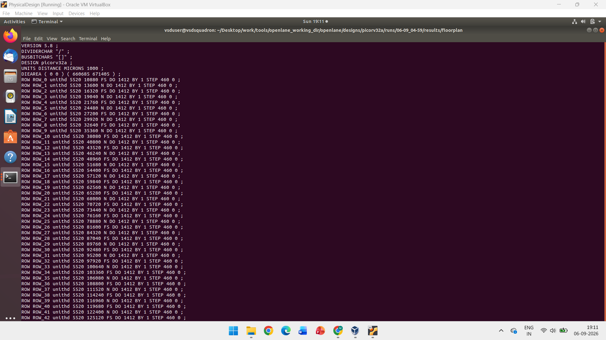
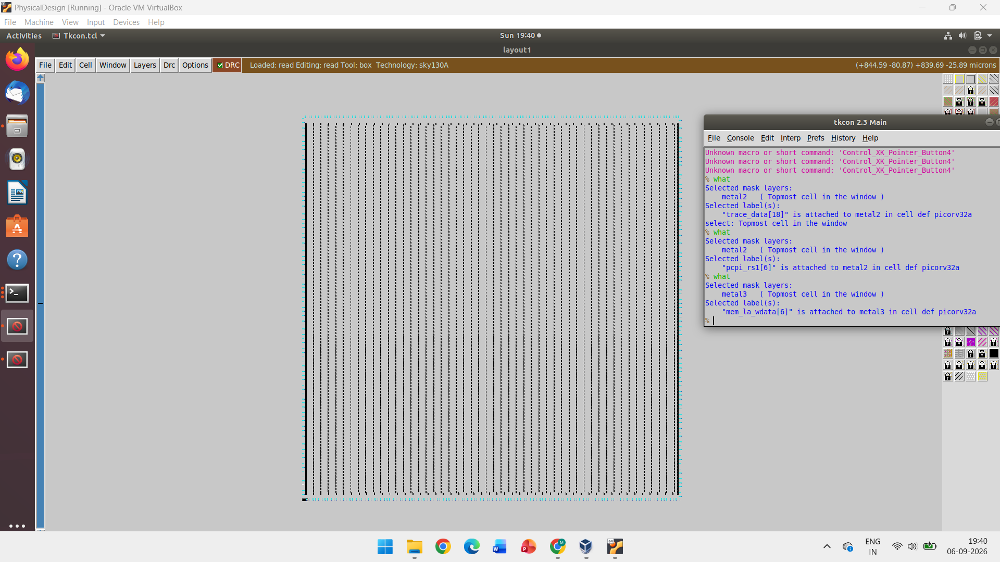
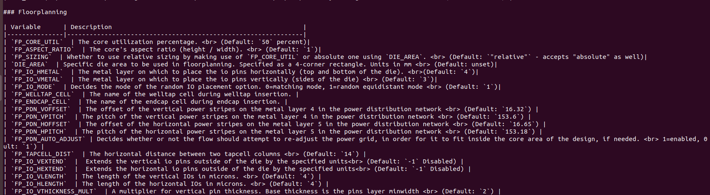
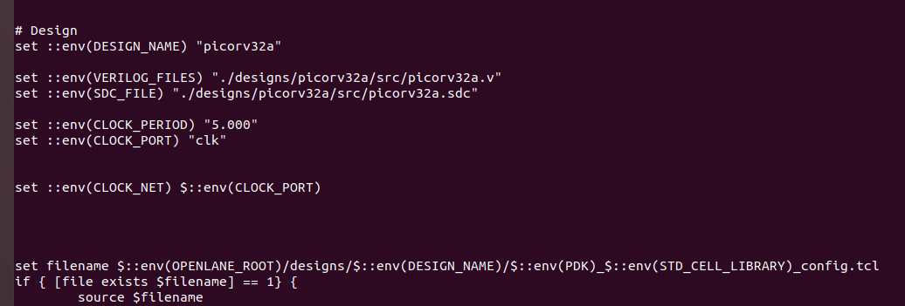
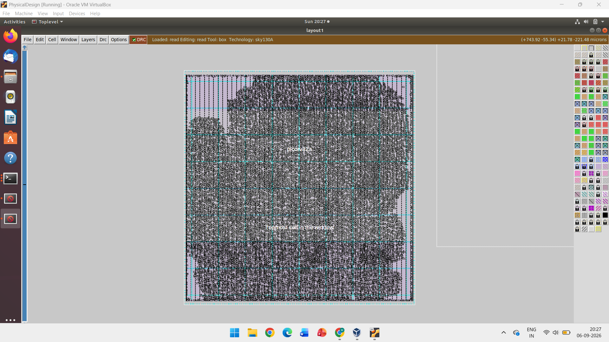
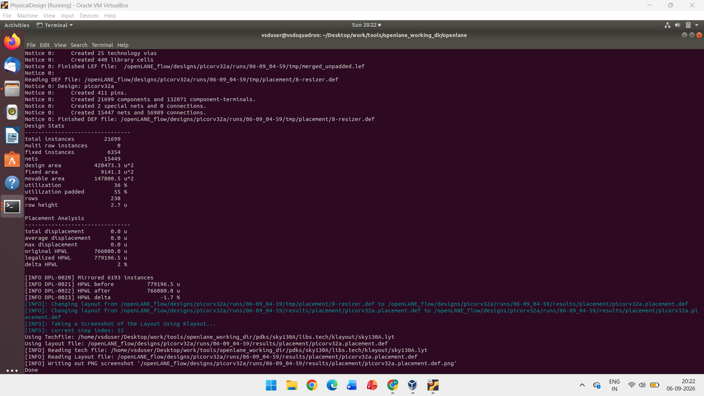

# Floorplanning and Placement - PicoRV32A

The main topics covered are:

- Core and die dimensions
- Aspect ratio
- Utilization
- Floorplanning
- Power planning
- Pin placement
- Pre-placed cells
- Decoupling capacitors
- Placement
- Placement optimization
- Placement statistics

---

## 1.  Overview

The main objective is to understand how the synthesized netlist is converted into a physical layout.

The basic flow is:

```text
Synthesized Netlist
        ↓
Floorplanning
        ↓
Power Planning
        ↓
Pin Placement
        ↓
Placement
        ↓
Placement Optimization
```

---

## 2. Core and Die

### Core

The core is the area where the main logic cells of the design are placed.

### Die

The die is the complete silicon area containing the core and other required regions.

```text
+---------------------------+
|            DIE            |
|                           |
|     +---------------+     |
|     |               |     |
|     |     CORE      |     |
|     |               |     |
|     +---------------+     |
|                           |
+---------------------------+
```

The final chip is fabricated on a silicon wafer.


---

## 3. Aspect Ratio and Utilization

### Aspect Ratio

Aspect ratio is defined as:

```text
Aspect Ratio = Height / Width
```

For example:

```text
Aspect Ratio = 1
```

means the chip is approximately square.

If the aspect ratio is different, the chip becomes rectangular.

### Utilization

Utilization tells us how much of the core area is occupied by the logic cells.

```text
Utilization =
Area occupied by cells
---------------------- × 100
Total core area
```

Higher utilization means more cells are packed into the available area.



---

## 4. Floorplanning

Floorplanning is the first major physical design step after synthesis.

It decides:

- Core size
- Die size
- Aspect ratio
- Utilization
- I/O locations
- Location of large blocks
- Power distribution requirements

A good floorplan helps to reduce routing congestion and improve timing.



---

## 5. Floorplan Configuration

OpenLane provides different variables to control floorplanning.

Some important variables are:

```text
FP_CORE_UTIL
FP_ASPECT_RATIO
FP_SIZING
DIE_AREA
FP_IO_HMETAL
FP_IO_VMETAL
FP_IO_MODE
FP_PDN_VPITCH
FP_PDN_HPITCH
```

These variables control the core utilization, aspect ratio, die area, I/O layers and power distribution network.



---

## 6. OpenLane Configuration

The design configuration contains important parameters required for the flow.

Example:

```tcl
set ::env(DESIGN_NAME) "picorv32a"

set ::env(VERILOG_FILES) \
"./designs/picorv32a/src/picorv32a.v"

set ::env(SDC_FILE) \
"./designs/picorv32a/src/picorv32a.sdc"

set ::env(CLOCK_PERIOD) "5.000"

set ::env(CLOCK_PORT) "clk"

set ::env(CLOCK_NET) $::env(CLOCK_PORT)
```

These settings define the design name, RTL file, timing constraints and clock information.



---

## 7. Pre-Placed Cells

Some blocks or IPs may need fixed locations before automated placement.

Examples include:

- Memory
- Multiplexer
- Comparator
- Clock-gating cells
- Other large IP blocks

These are called **pre-placed cells**.

Automated placement and routing tools place the remaining standard cells around them.

---

## 8. Power Planning

Power planning creates a proper power distribution network for the chip.

The main power signals are:

```text
VDD → Power supply
VSS → Ground
```

Power rings and power straps are created to distribute power throughout the chip.

Multiple power connections help reduce:

- Voltage drop
- Ground bounce
- Power noise

```text
Power Network
     ↓
VDD / VSS
     ↓
Power Rings
     ↓
Power Straps
     ↓
Standard Cells
```

---

## 9. Decoupling Capacitors

Decoupling capacitors are used to reduce power supply noise.

When many cells switch at the same time, they can suddenly draw current from the power network.

A decoupling capacitor can provide local charge during this switching.

```text
VDD
 |
 +---- Decoupling Capacitor
 |
Circuit
 |
VSS
```

This helps maintain a stable supply voltage and reduces the effect of voltage fluctuations.

---

## 10. Pin Placement

Pin placement decides where the input and output pins are located on the chip.

The netlist contains the connectivity information between different cells.

I/O pins can be placed on different sides of the die depending on the design requirements.

Common locations include:

- Left
- Right
- Top
- Bottom

Clock pins may require special consideration because of their importance in timing.

---

## 11. Logical Cell Placement Blockage

After placing important IPs and pins, some regions can be blocked from standard-cell placement.

Placement blockages prevent standard cells from being placed in unwanted areas.

```text
+-----------------------+
| Standard Cells        |
|                       |
|     BLOCKED AREA      |
|                       |
| Standard Cells        |
+-----------------------+
```

This helps protect important regions and improves physical design control.

---

## 12. Placement

Placement decides the physical location of standard cells inside the core.

The placement process tries to:

- Reduce wire length
- Reduce congestion
- Improve timing
- Maintain legal cell positions
- Keep connected cells closer

The basic flow is:

```text
Netlist
   ↓
Global Placement
   ↓
Detailed Placement
   ↓
Optimized Placement
```



---

## 13. Placement Optimization

After initial placement, the design is optimized.

During optimization, the tool estimates:

- Wire length
- Capacitance
- Delay
- Congestion
- Timing

Buffers or repeaters may be added when required.

### Repeaters

Repeaters are usually buffers inserted on long signal paths.

```text
Cell ─────── Buffer ─────── Cell
```

They help maintain signal quality over long interconnects.

---

## 14. Placement Statistics

After placement, the tool provides important design statistics.

Example results from the placement stage:

```text
Total Instances      : 21699
Fixed Instances      : 6354
Nets                 : 15449
Design Area          : 420473.3 um²
Utilization          : 36%
Utilization Padded   : 55%
Rows                 : 238
```

Placement analysis also provides information about wire length and displacement.

### Important Parameters

```text
Design Area
Utilization
Number of Instances
Number of Nets
Wire Length
Placement Displacement
```



---

## 15.  Results and Learning

### Floorplanning Result

The floorplan defines the physical area in which the design will be implemented.


### Placement Result

After floorplanning, the standard cells are placed inside the core.


### What I Learned

 I learned the basic concepts of physical floorplanning and placement.

The main concepts covered were:

```text
Core
Die
Aspect Ratio
Utilization
Floorplanning
Pre-Placed Cells
Power Planning
Decoupling Capacitors
Pin Placement
Placement Blockages
Placement
Placement Optimization
Placement Statistics
```

The physical design flow learned so far is:

```text
RTL
 ↓
Synthesis
 ↓
Netlist
 ↓
Floorplanning
 ↓
Power Planning
 ↓
Pin Placement
 ↓
Placement
 ↓
Placement Optimization
```

The next stage is to continue with **Clock Tree Synthesis (CTS), Routing and timing analysis**.


